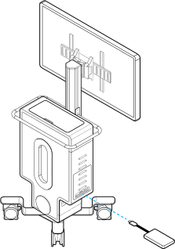

To transfer recorded video or snapshots to an external hard drive, connect the drive to a USB 3.0 connector (recommended) on the cart side panel or a USB 2.0 connector on the cart front panel. The drive must be in exFAT format. Alcon recommends using only 1 drive at a time.

Do not connect or use an external hard drive during surgery. If the hard drive is protected or has a password, unlock the drive before use.

To eject the drive, click **Eject Drive** on the Home screen or disconnect the drive after a system shutdown.
