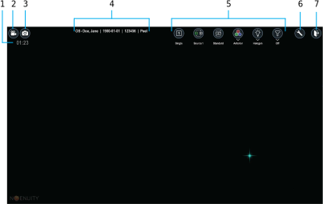
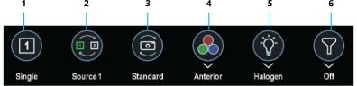

## Live Cases

In the Home panel, click **Start Case**.

Do not connect or disconnect any displays to the system during live surgery. Visualization is interrupted while the system reinitializes the display.

### Procedure Screen Layout

  
  
  
  
  
  
  

All buttons are hidden after 5 seconds of cursor inactivity. To unhide them, move the cursor.

### Recordings

Recordings save video from the camera. To save overlay information, enable the applicable DataFusion feature. Overlay information includes patient and case information from the system, or other data from connected systems.

The Quick Access Bar contains specified buttons for display options. Click the buttons to quickly change settings or, if available, click the drop-down menu below buttons to select a specific option.

Use the Quick Access Bar to change the following display modes and settings:  

  
  
  
  
  
  

## End Case

When the case is complete, click **End Case**. Recordings stop and the following prompts appear:
1. If any imaging mode changes were made during the case, select **Yes** to save the changes or **No** to delete the changes.
2. If desired, save recorded video. To save a copy of the video to an external hard drive, connect one to a [side panel USB connector](../../additional/external_usb).
3. If a patient profile was not selected, enter patient information.
4. If desired, enter keywords for sorting and searching files in TrueMedia. The folder name is the case
start time by default and appears in TrueMedia.
