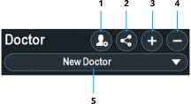

Doctor profiles save customized user settings for optimal visualization. Manage the profiles on the system from the Home panel.

  
  
  
  
  

## Add a Doctor Profile

To create a new doctor profile, perform the following:
1. In the Home panel, select the doctor **Add** button. The New Doctor dialog box opens.
2. In the Name field, enter a profile name.
3. To copy settings from another profile, perform the following:
   1. Click the **Copy Settings From** toggle switch.
   1. Click **Local** to copy a profile stored on the system or click USB to copy a profile from a connected USB drive.
   1. In the Doctor drop-down menu, select a profile.
4. Click **Confirm**.

## Delete a Doctor Profile

1. In the Home panel, select a doctor profile.
2. Click the doctor **Delete** button.
3. Click **Confirm**.

## Set Doctor Profile Settings

1. In the Home panel, select a doctor profile.
2. Click **Doctor Defaults**.
3. Perform one of the following:
   * Click **Save all** to save the current settings as the profile default settings.
   * Click **Restore all** to set the current settings to the saved profile default settings.

## Export Doctor Profile

1. Connect a USB drive to a USB connector.
2. In the Home panel, select a doctor profile.
3. Click **Export Doctor**.
