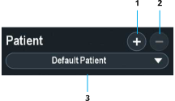

Patient profiles store basic patient information. Manage patient profiles in the Home panel.

  
  


## Add a Patient Profile

1. In the Home panel, select the patient **Add** button. The Patient Information dialog box opens.
2. Enter a first and last name.
3. Select one of the following:
   * **OD** – right eye
   * **OS** – left eye
4. To add a date of birth, patient ID name, or procedure, click **Optional Data**.
a. In the **Date of Birth** field, enter a year, month, and day.
b. In the **ID** field, enter a unique identification code.
c. Select a procedure.
d. To add a procedure, click **Add**. To delete a procedure, click **Delete**. New procedures are selectable for other patient profiles.
5. Click **Confirm**.

## Delete a Patient Profile

1. In the Home panel, select a patient profile.
2. Click the patient **Delete** button.
3. Click **Confirm**.
