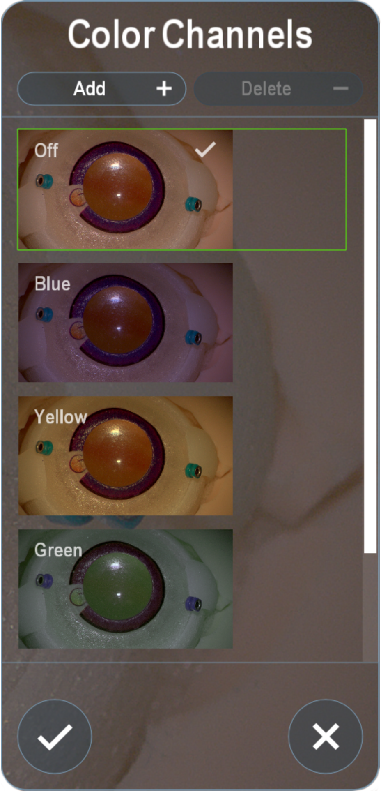

To access Color Channel options, click **Color Channel**. The system previews adjusted color channels in the Color Channel dialog box.

## Editing Color Channels

1. Click an existing color channel.
2. Click **Edit**.
3. In the **Name** field, enter a new name if needed.
4. Adjust the sliders to place emphasis on certain colors.
5. Enable **Advanced Settings** to adjust brightness, contrast, gamma correction, hue, and saturation.  

## Adding Color Channels

1. Click **Add**.
2. In the **Name** field, enter a descriptive name.
3. Adjust the color channel sliders as needed.
4. Enable **Advanced Settings** to adjust brightness, contrast, gamma correction, hue, and saturation.

## Deleting Color Channels

1. Select an existing color channel.
2. Click **Delete**.
