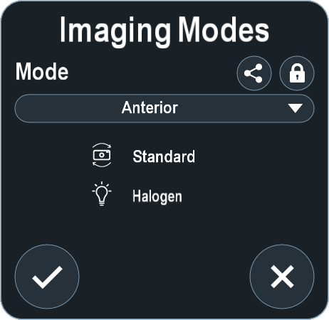
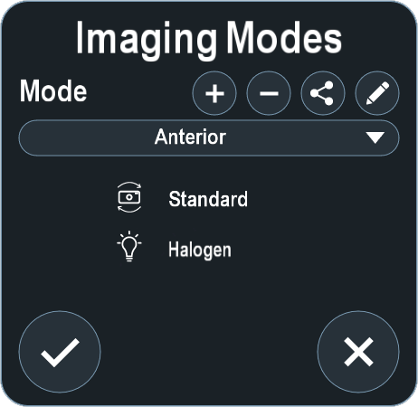
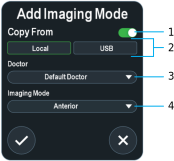
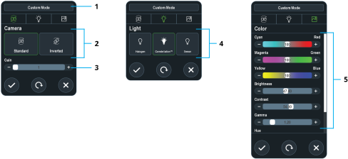

Imaging modes are a core visualization baseline for routine cases. To access Imaging Mode options, click **Imaging Mode**. If operating with different illumination sources or optical systems that require inverted camera orientation, Alcon recommends creating a custom imaging mode to accommodate individual surgical workflows.

The default imaging modes include the following:

| Imaging Mode | Camera Orientation | Light Profile |
| :---: | :---: | :---: |
| Anterior | Standard | Halogen |
| Posterior | Inverted | Constellation™ |
| Macular | Standard | Constellation™ |

To copy, edit, or delete imaging modes, click **Unlock** and then **Confirm**.

## Copying Imaging Modes

To copy an imaging mode from an existing mode, click **Add**.

  
  
  
  

## Adding or Editing Imaging Modes

Alcon recommends contacting Technical Service for support.

1. Perform one of the following:
    * To add an imaging mode, click **Add** and then **Confirm**. If necessary, disable Copy From.
    * To edit an imaging mode, select an imaging mode and click **Edit**.
2. If necessary, enter a new name.

  
  
  
  


## Deleting Imaging modes

1. Select an imaging mode.
2. Click **Delete**.

## Exporting Imaging modes

1. Select an imaging mode.
2. Click **Export**.
