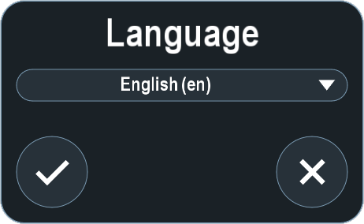

The Language system settings control the language the system displays. Contact Technical Services for additional languages.

To change the language, perform the following:

1. In the **Language** drop-down menu, select a language.
2. Click **Confirm**.
