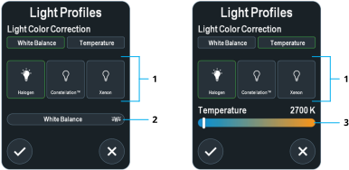

Light profile settings correct color for different illumination sources. To access Light Profile options, click **Light Profile**. Alcon recommends matching the illumination source with the corresponding light profile.

  
  
  
