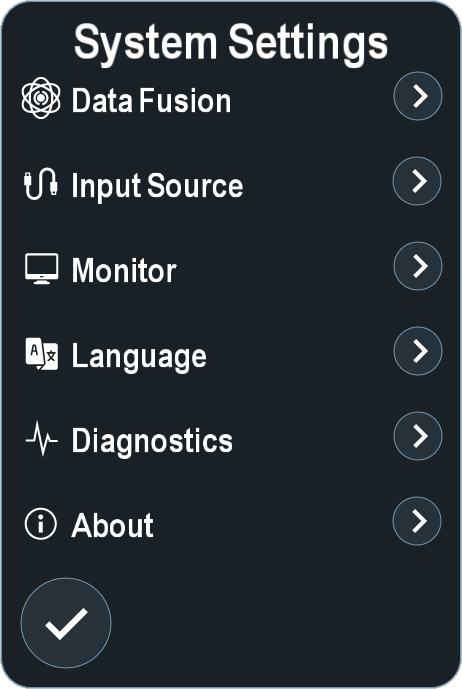
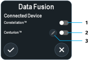
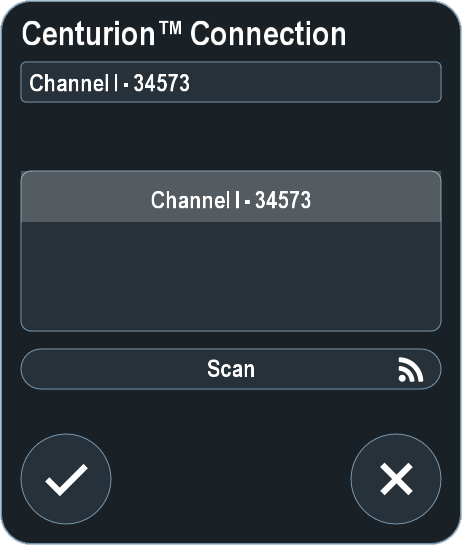
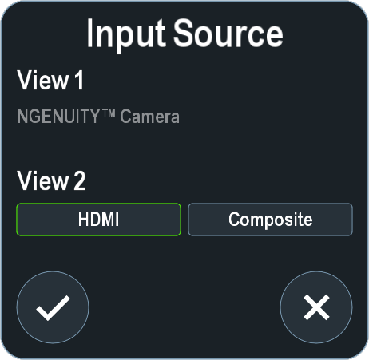
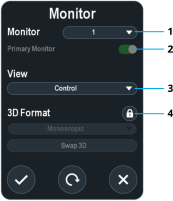
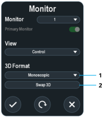
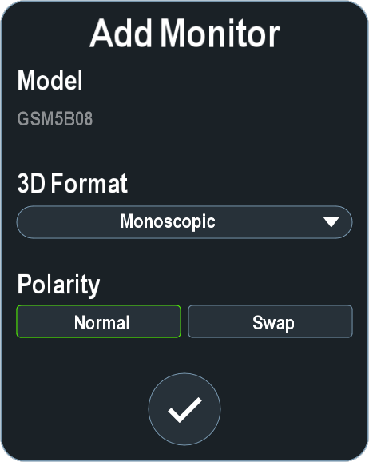

System settings apply to all doctor profiles on the system and are primarily related to connecting devices to the system. They also include system information. To access System Setting options, click **System Settings**.

## DataFusion

The DataFusion settings determine which device is connected to the system. To access DataFusion options, click **DataFusion**. The system can only enable one device at a time.

  
  
  

To connect to a Centurion&trade;, perform the following:

1. Click **Edit**.

    

2. Press **Scan**.
3. Select the device from the list.
4. If necessary, enter a new name for the device. This name only appears in the system.
5. Click **Confirm**.

## Input Source

The input source controls which port is displayed in the secondary view. To set the secondary input source, click **Input Source**.

No other sources are available for systems with a connected ORA SYSTEM&trade;.

In the View 2 panel, select one of the following:

* **HDMI** – Displays the input source from a connected ORA SYSTEM&trade;.
* **Composite** – Displays the input source connected to the front panel composite connector.

## Monitor

The monitor system settings have adjustable settings for displays connected to the system. To access Monitor options, click **Monitor**.

### Basic Monitor Settings

Only the provided monitor should be used as the Primary Monitor.

  
  
  
  

### 3D Format Settings

  


### Add Monitor

The Add Monitor panel displays after connecting a new monitor to the system.

To add a monitor, perform the following:

1. In the **3D Format** drop-down menu, select a format.
2. In the Polarity panel, select one of the following:
   * **Normal** – Renders left and then right stereoscopic images.
   * **Swap** – Renders right and then left stereoscopic images.

### 3D Polarity

To determine if the 3D monitor has the correct polarity, perform the following:

1. Put on the 3D glasses.
2. Close your right eye.
3. Verify you can only see the “Left” on-screen text.
4. Repeat the process with the other eye and verify that you only see the “Right” on-screen text.
