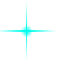
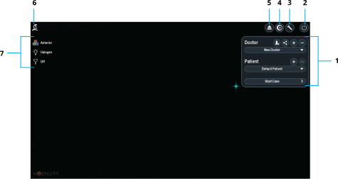
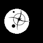
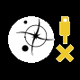

To navigate the system interface, use the touchpad and keyboard to select items or enter text. To start operating, select a doctor profile and patient profile.

## Navigation Icons

The following icons appear throughout the interface.

| Icon | Description |
| :---: | --- |
|  | Indicates the touchpad cursor location. |
|  | Saves the pending changes and closes the dialog box. Switching to a different setting panel saves any pending changes. |
|  | Closes the dialog box and does not save pending changes. |
|  | Opens another dialog box to change additional settings. |
|  | Saves settings to a connected USB drive. |
|  | Opens the next screen or dialog box. |
|  | Returns to the previous screen or dialog box. |
|  | Sets the settings to the default values. |

## Home Screen Layout

  
  
  
  
  
  
  

|  | Connected | Disconnected |
| --- | :---: | :---: |
| Constellation |  |  |
| Centurion |  |  |
