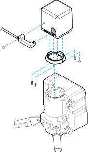

In case of emergency, keep the microscope oculars and mounting accessories in the cart top drawer. If there are any concerns regarding the continued safe use of the system, consider returning to the oculars.

Mount the camera to a surgical microscope. Depending on the microscope model, install either a Z-ring or L-ring bracket to the camera lens (see the letters in the image below). The Z-ring bracket is for Alcon or Zeiss&trade; microscopes and the L-ring bracket is for Leica&trade; microscopes. Ensure the entire optical path is clean and free of dust before attaching the camera.

<figurecaption>Z-Ring (Left) and L-Ring (Right)</figurecaption>

1. Mount the applicable ring bracket.
2. Connect the camera to the microscope with the slider facing the user.
3. Loosely wrap the camera cable around the microscope arm so that the cable does not interfere with the surgery or restrict the movement of the microscope. Use hook-and-loop fasteners to secure the cable to the microscope.
4. Connect the USB camera cable to the camera.
5. Secure the cable strain relief to the camera case using the thumbscrew.
