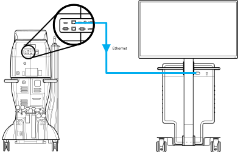
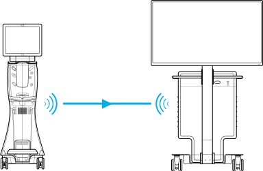
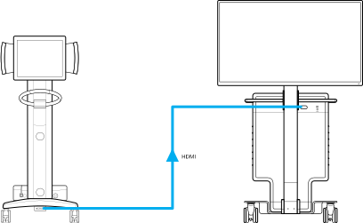

To configure connected devices with the system, contact Technical Services.

## Constellation&trade; Connection

Only the Constellation Vision System should be connected to an Ethernet port on the embedded processing unit (EPU) during normal system operation. The other Ethernet ports are for maintenance purposes only.

Connect the Ethernet cable from the system to the Constellation&trade; Ethernet connector and setup DataFusion settings on the system.

## Centurion&trade; Connection

Enable wireless communication on the Centurion&trade; and setup DataFusion settings on the system

## ORA SYSTEM&trade; Connection

Connect the provided HDMI cable to the HDMI output connector on the ORA SYSTEM&trade;.

