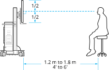
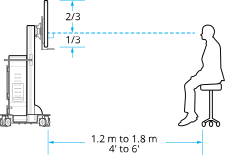

Before operating the system, position the system and all components for optimal user conditions.

## System Movement

Do not push or pull unit by the display or any cable. The unit should be pulled and not pushed, especially over elevator and door thresholds.

To move the system around the room, unlock the casters. Each castor on the cart has three modes, controlled by the brake pedal. Set each castor in total lock mode while the system is being used.

| Symbol | Description |
| :---: | --- |
|  | The casters do not rotate |
|  | Unlocked |
|  | Total Lock |

## Display Articulation

The display moves up or down the mast, rotates side to side, and tilts back or forth. Only grasp the bottom or sides of the display while adjusting it. Avoid putting stress on the top of the display.

If necessary, loosen the adjustment knobs on the display mounting bracket to adjust the tilt and tighten them to secure it. Do not remove the adjustment knobs.

## View Optimization

For the best 3D effect, place the display next to the patient bed, between 4′ to 6′ (1.2 m to 1.8 m) away from the user. Depending on the display, align either the bottom third or middle of the display perpendicular with the line of sight of the seated user. If necessary, also ensure other viewers have a satisfactory view.

