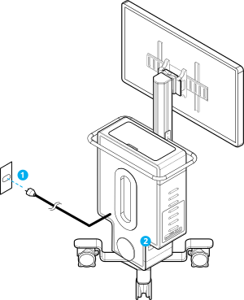

{}

* System isolation from mains is achieved through detachment of power cord. Turn OFF the power switch and unplug the power cord from wall outlet to achieve isolation from mains. Do not bypass the isolation transformer and connect any of the NGENUITY&trade; components directly to a wall outlet.
* To avoid risk of electric shock, this equipment must only be connected to a supply mains with protective earth (ground).
* The system should be connected to an uninterruptible power source when loss of power would result in an unacceptable risk.

{}

Grounding reliability can only be achieved when equipment is connected to an equivalent receptacle marked ‘Hospital Grade’.

Ensure the camera is connected before turning on the system.

To power the system, perform the following:
1. Connect the power cable to a hospital-grade power outlet.
2. Turn on the main power switch. Wait 30 seconds for the system to initialize. The display and software automatically start.
3. Adjust the height, tilt, and distance of the display according to user preferences.
