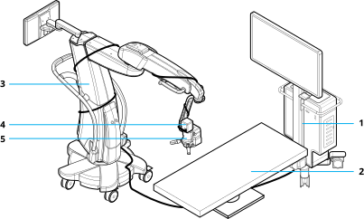
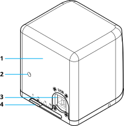
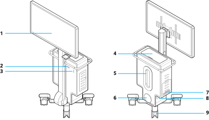
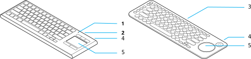
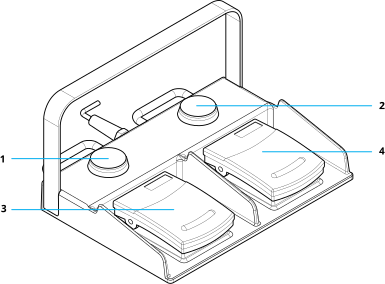

At a minimum, the system includes the cart, camera, microscope, 3D glasses, keyboard, and touchpad. To optimize operation, incorporate additional devices such as the following:

  
  
  
  


## Camera

The camera is a stereoscopic 3D camera with high dynamic range. Mount the camera on a surgical microscope.

  
  
  


## Cart

The cart receives video input from the camera and additional data from other connected devices, and then outputs the results on the monitor.

  
  
  
  
  
  
  
  


## Displays

Depending on the display model, the system connects to the display either through DisplayPort input 1 or both the HDMI input 3 and COMM cable connector. The system also supports a secondary display to either duplicate the primary display view or show a subset of features.

## Glasses

3D images require passive, circularly-polarized 3D glasses. If necessary, wear the 3D glasses over prescription glasses.

{}

* To ensure optimal image quality, the system should only be used with Alcon-supplied 3D glasses. Contact Alcon if additional pairs are required. Polarized prescription glasses will distort the 3D effect and should not be used.
* The 3D glasses must be worn in front of the laser protective eyewear to avoid distorting the 3D effect.

{}

## Keyboard and Mouse

The system includes both a wired and a wireless keyboard with an integrated touchpad. The wireless keyboard is and the battery indicator displays the charge level while the keyboard is on.

  

* **Blinking green** &ndash; The battery is charging.  
* **Solid green** &ndash; The battery has adequate charge.  
* **Blinking red** &ndash; The battery power is low. Recharge the battery.  

  
  
  
  

## DataFusion

The Constellation&trade;, Centurion&trade;, and ORA SYSTEM&trade; provide additional patient and surgical operation information to display on the system. The Constellation&trade; and Centurion&trade; systems displays the information on the surgical screen while the ORA SYSTEM&trade; displays the information in PiP or split screen layouts. The Constellation&trade; also controls basic system functions. The ORA SYSTEM&trade; dynamic reticle displays on the live image (activate on the ORA SYSTEM&trade;).

## Footswitch (Optional)

The footswitch performs basic functions during operation through controls operated by a foot.

  
  
  


## Accessories

The system may include the following accessories:

* **Lens cap** &ndash; Protects the camera lens.
* **Cable straps** &ndash; Secure the camera cable to the microscope.
* **Cable hooks** &ndash; Route loose cables or coil cable for storage or transportation.
* **Display remote and batteries** &ndash; Sets the display settings. Use only if directed by Technical Services. The remote may require AA or AAA batteries depending on the display modal.
* **Screen protector** &ndash; Protects the display when the system is in storage.
* **Wired keyboard** &ndash; Controls the system.
* **USB extension cable** &ndash; Powers the wireless keyboard or extends other USB connections.
* **Fabric target** &ndash; Helps check the color, focus, and depth of field of the microscope.
* **White balance card** &ndash; Helps with setting the system white balance and for focus and alignment.
* **Thumbscrew** &ndash; Secures the camera to the microscope.
* **DataFusion cables** &ndash; Connect a Constellation&trade; (Ethernet) or ORA SYSTEM&trade; (HDMI).
