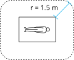

The NGENUITY&trade; system is designed to work in the Professional Healthcare facility environment.

The NGENUITY&trade; system requires special precautions regarding EMC and needs to be installed and put into service according to the EMC information provided in the below tables.

The NGENUITY&trade; system is a medical device designated for Indoor Use Only.

{}

* Use of this system adjacent to or stacked with other equipment should be avoided because it could result in improper operation. If such use is necessary, this equipment and the other equipment should be observed to verify that they are operating normally.
* Use of cables or accessories other than those specified, with the exception of cables and accessories sold by the manufacturer of the system as replacement parts for internal components, may result in increased emissions or decreased immunity of the system.
* Use of accessories and cables other than those provided may result in increased emissions or decreased immunity of the system. Portable and mobile RF communication equipment can affect this medical electrical equipment.

{}

## Safeguards for Use with Other Medical Equipment

{}

* All equipment connected to this unit shall be certified according to IEC 60601-1 or other IEC/ISO standards applicable to the equipment.
* Furthermore, all complete configurations shall comply with IEC 60601-1. If the user connects additional equipment to the signal input or signal output, this alters the medical device system, and it is then the user’s responsibility that the system complies with the requirements of the standard IEC 60601-1. If in doubt, contact Alcon Technical Services.
* When this unit is used together with other equipment in the patient area, the equipment shall be either powered by an isolation transformer (internal in the system) or connected via an additional protective earth terminal to system ground unless it is certified according to IEC 60601-1.  
   
* The leakage current could increase when connected to other equipment.
* This equipment generates, uses, and can radiate radio frequency energy. If it is not installed and used in accordance with the instruction manual, it may cause interference to other equipment. If this unit causes interference (which can be determined by unplugging the power cord from the unit), try these measures: relocate the unit with respect to the susceptible equipment and plug this unit and the susceptible equipment into different branch circuits.
* The operator should take precautions to avoid touching any system components and the patient at the same time.
* The system should be positioned so that it is not difficult to disconnect the power plug from the supply mains.

{}

## Guidance and Manufacturer Declaration - Electromagnetic Emissions

The NGENUITY&trade; system is intended for use in the electromagnetic environments specified below. The customer or the user of the*NGENUITY&trade; system should assure it is used in such an environment.

| Emissions Test | Compliance | Electromagnetic Environment - Guidance |
| --- | --- | --- |
| RF Emissions (CISPR 11) | Group 1 | The system uses RF energy only for its internal functions. Therefore, its RF emissions are low and are not likely to cause any interference in nearby electronic equipment. |
| Conducted Emissions (CISPR 11) | Class A | The emissions characteristics of the system make it suitable for use in industrial areas and hospitals (CISPR 11 class A). If it is used in a residential environment (for which CISPR 11 class B is normally required) system might not offer adequate protection to radio-frequency communication services. The user might need to take mitigation measures, such as relocating or re-orienting the equipment. |
| Harmonics Emissions (IEC 61000-3-2) | Class A | The emissions characteristics of the system make it suitable for use in industrial areas and hospitals (CISPR 11 class A). If it is used in a residential environment (for which CISPR 11 class B is normally required) system might not offer adequate protection to radio-frequency communication services. The user might need to take mitigation measures, such as relocating or re-orienting the equipment. |
| Voltage Fluctuations/Flicker Emissions (IEC 61000-3-3) | Complies | The emissions characteristics of the system make it suitable for use in industrial areas and hospitals (CISPR 11 class A). If it is used in a residential environment (for which CISPR 11 class B is normally required) system might not offer adequate protection to radio-frequency communication services. The user might need to take mitigation measures, such as relocating or re-orienting the equipment. |

## Guidance and Manufacturer Declaration - Electromagnetic Immunity

The NGENUITY&trade; system is intended for use in the electromagnetic environments specified below. The customer or the user of the NGENUITY&trade; system should assure it is used in such an environment.

| Immunity Test | IEC 60601 Test and Compliance Level | Electromagnetic Environment - Guidance |
| --- | --- | --- |
| Electrostatic Discharge (IEC 61000-4-2) | +/-8 kV contact, +/-15 kV air | Floors should be wood, concrete, or ceramic tile. If floors are covered with synthetic material, the relative humidity should be at least 30%. |
| Electrical Fast Transient/Burst (IEC 61000-4-4) | +/-2 kV on power supply lines, +/- kV on input/output lines | Mains power quality should be that of a typical commercial or hospital environment. |
| Surge (IEC 61000-4-5) | +/- kV Differential Mode | Mains power quality should be that of a typical commercial or hospital environment. |
| Power Frequency (50/60 Hz) Magnetic Fields (IEC 61000-4-8) | 30 A/m, 50 or 60 Hz | Power frequency magnetic fields should be at levels characteristic of a typical location in a typical commercial or hospital environment. |
| Voltage Dips, Short Interrupts, and Variations on Power Supply Line (IEC 61000-4-11) | 0% UT for 0.5 cycle at 0&deg;, 45&deg;, 90&deg;, 135&deg;, 180&deg;, 225&deg;, 270&deg;, and 315&deg;. 0% UT for 1 cycle. 70% UT for 25/30 cycles. 0% UT for 250/300 cycles. | Mains power quality should be that of a typical commercial or hospital environment. If the user of the system requires continued operation during power mains interruptions, it is recommended that the system be powered from an uninterruptible power supply or a battery. |
| Conducted RF (IEC 61000-4-6) | 3 Vrms, 150 kHz to 80 MHz. 6 Vrms at ISM frequencies | The ISM (industrial, scientific and medical) bands between 150 kHz and 80 MHz are 6.765 MHz to 6.795 MHz; 13.553 MHz to 13.567 MHz; 26.957 MHz to 27.283 MHz; and 40.66 MHz to 40.70 MHz. |
| Radiated RF (IEC 61000-4-3), Proximity Fields from RF wireless communication equipment (IEC 61000-4-3) | 3 V/m, 80 MHz to 2.7 GHz (see following table) | Since IEC 60601-1-2 Edition 2.1 and Edition 3 were developed, new digital wireless technologies have been introduced not only to hospitals, but are also in widespread use by the general public. In addition, existing technologies are being used in ways that they were not used before. The IMMUNITY TEST LEVELS specified in the table were calculated using the following equation: E=(6√P)/d. Where P is the maximum power in W, d is the minimum separation distance in m, and E is the Immunity Test Level in V/m. The factor of 6 is a compromise for a range of antenna factors, to simplify the test. |

| Frequency (MHz) | Level (V/m) |
| --- | --- |
| 385 | 27 |
| 450 | 28 |
| 710, 745, 780 | 9 |
| 810, 870, 930 | 28 |
| 1720, 1845, 1970 | 28 |
| 2450 | 28 |
| 5240, 550, 5785 | 9 |

{}

UT is the AC mains voltage prior to application of the test level. The compliance levels in the ISM frequency range 150 kHz to 2.5 GHz are intended to decrease the likelihood that mobile or portable communications equipment could cause interference if it is inadvertently brought into the patient area. However, Emission limits, IEC 60601 Test Levels, and tests specified in IEC 60601-1-2:2001 do not address Electromagnetic Compatibility of electrical equipment at very close distances. Care should always be exercised when using any electrical or RF equipment in the immediate patient area.

{}

{}

Portable RF communications equipment (including peripherals such as antenna cables and external antennas) should be used no closer than 30 cm (12 inches) to any part of the NGENUITY™ system including cables specified by the manufacturer. Otherwise, degradation of the performance of this equipment could result.

{}
